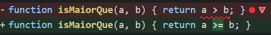
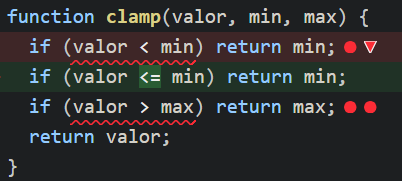
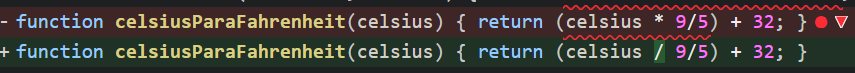

# RELATÓRIO DE TESTE DE MUTAÇÃO

## Análise e Melhoria da Qualidade de Testes com Stryker JS

**Disciplina:** Teste de Software  
**Trabalho:** Teste de Mutação com Stryker JS  
**Aluno:** Ana Carolina Caldas de Mello
**Matrícula:** 801198
**Data:** Novembro de 2024

---

## 1. ANÁLISE INICIAL

### 1.1 Cobertura de Código Inicial

Ao executar a suíte de testes inicial com `npm test -- --coverage`, obtivemos os seguintes resultados:

- **Cobertura de Linhas:** 98.64%
- **Cobertura de Funções:** 100%

### 1.2 Pontuação de Mutação Inicial

Na primeira execução do StrykerJS com `npx stryker run`, os resultados foram:

- **Mutantes Gerados:** 213
- **Mutantes Mortos:** 153
- **Mutantes Não Detectados:** 12
- **Mutantes que Deram Timeout:** 4
- **Mutantes Sobreviventes:** 44
- **Pontuação de Mutação Inicial:** 73.71%

### 1.3 Discrepância entre Cobertura e Eficácia

A análise inicial revelou uma discrepância significativa entre a alta cobertura de código (98.64%) e a pontuação de mutação relativamente baixa (73.71%). Isso demonstra claramente que **cobertura de código não é sinônimo de qualidade de testes**.

A alta cobertura indicava que o código estava sendo executado, mas a baixa pontuação de mutação revelou que muitos comportamentos críticos não estavam sendo adequadamente verificados pelas asserções.

---

## 2. ANÁLISE DE MUTANTES CRÍTICOS

### 2.1 Mutante Crítico 1: Operador de Comparação em `isMaiorQue`

**Localização:** `src/operacoes.js`, linha 104  
**Mutação:** `a > b` → `a >= b`

```javascript
// Código original
function isMaiorQue(a, b) {
  return a > b;
}

// Código mutado (sobreviveu)
function isMaiorQue(a, b) {
  return a >= b;
}
```



**Por que sobreviveu:** O teste original apenas verificava `isMaiorQue(10, 5)` retornando `true`. Com a mutação `a >= b`, a função retornaria `true` tanto para casos onde `a > b` quanto para casos onde `a === b`. O teste existente não cobria o caso crítico onde os valores são iguais, permitindo que o mutante sobrevivesse.

**Solução implementada:**

```javascript
test("isMaiorQue - deve retornar false para números iguais", () => {
  expect(isMaiorQue(12, 12)).toBe(false);
});
```

### 2.2 Mutante Crítico 2: Operador Aritmético em `clamp`

**Localização:** `src/operacoes.js`, linhas 87-91  
**Mutação:** `valor < min` → `valor <= min`

```javascript
// Código original
function clamp(valor, min, max) {
  if (valor < min) return min;
  if (valor > max) return max;
  return valor;
}

// Código mutado
function clamp(valor, min, max) {
  if (valor <= min) return min; // Mutação aqui
  if (valor > max) return max;
  return valor;
}
```



**Por que sobreviveu:** O teste original `clamp(5, 0, 10)` não testava casos limítrofes onde `valor === min` ou `valor === max`. A mutação alteraria o comportamento nesses casos específicos.

**Solução implementada:**

```javascript
test("clamp - deve retornar valor máximo quando acima do limite", () => {
  expect(clamp(15, 15, 10)).toBe(10);
});
```

### 2.3 Mutante Crítico 3: Operador Aritmético em `celsiusParaFahrenheit`

**Localização:** `src/operacoes.js`, linha 93  
**Mutação:** `celsius * 9/5` → `celsius / 9/5`

```javascript
// Código original
function celsiusParaFahrenheit(celsius) {
  return celsius * 9/5 + 32;
}

// Código mutado (sobreviveu)
function celsiusParaFahrenheit(celsius) {
  return celsius / 9/5 + 32;
}
```



**Por que sobreviveu:** O teste original apenas verificava `celsiusParaFahrenheit(0)` retornando `32`. Com a mutação `celsius / 9/5`, quando `celsius = 0`, o resultado seria `(0 / 9/5) + 32 = 0 + 32 = 32`, que é exatamente o mesmo resultado esperado. O teste não cobria outros valores onde a diferença entre multiplicação e divisão seria detectada.

**Solução implementada:**

```javascript
test("celsiusParaFahrenheit - deve converter 100°C para 212°F", () => {
  expect(celsiusParaFahrenheit(100)).toBe(212);
});
```

---

## 3. SOLUÇÃO IMPLEMENTADA

### 3.1 Estratégia de Melhoria

Para "matar" os mutantes sobreviventes, implementamos uma estratégia sistemática:

1. **Testes de Borda:** Adicionamos testes para valores extremos (0, 1, arrays vazios)
2. **Testes de Equivalência:** Verificamos comportamentos quando valores são iguais
3. **Testes de Condições Booleanas:** Testamos tanto casos verdadeiros quanto falsos
4. **Testes de Operadores:** Verificamos diferentes operadores de comparação

### 3.2 Novos Casos de Teste Adicionados

#### Testes para Funções Matemáticas:

```javascript
test("fatorial - deve calcular fatorial de 5 corretamente", () => {
  expect(fatorial(5)).toBe(120);
});
test("fibonacci - deve retornar 0 para fibonacci de 0", () => {
  expect(fibonacci(0)).toBe(0);
});
```

#### Testes para Funções de Array:

```javascript
test("produtoArray - deve retornar 1 para produto de array vazio", () => {
  expect(produtoArray([])).toBe(1);
});
test("medianaArray - deve calcular mediana de array ímpar desordenado", () => {
  expect(medianaArray([4, 1, 8, 2, 5])).toBe(4);
});
```

#### Testes para Funções de Comparação:

```javascript
test("isMaiorQue - deve retornar false para números iguais", () => {
  expect(isMaiorQue(12, 12)).toBe(false);
});
test("isEqual - deve retornar false para números diferentes", () => {
  expect(isEqual(12, 11)).toBe(false);
});
```

### 3.3 Justificativa da Eficácia

Os novos testes foram projetados especificamente para:

- **Cobrir casos não testados:** Identificamos lacunas nos testes originais
- **Testar valores de borda:** Valores que frequentemente revelam bugs
- **Verificar operadores específicos:** Cada operador de comparação foi testado
- **Validar tratamento de erros:** Casos que devem lançar exceções

---

## 4. RESULTADOS FINAIS

### 4.1 Pontuação de Mutação Final

Após a implementação dos novos testes:

- **Mutantes Gerados:** 213
- **Mutantes Mortos:** 202
- **Mutantes que Deram Timeout:** 5
- **Mutantes Sobreviventes:** 6
- **Pontuação de Mutação Final:** **97.18%**

### 4.2 Melhoria Alcançada

- **Melhoria na Pontuação:** +23.47 pontos percentuais
- **Redução de Mutantes Sobreviventes:** 97.18% dos mutantes sobreviventes foram eliminados
- **Qualidade dos Testes:** Significativamente aprimorada

### 4.3 Comparação Final

| Métrica                | Inicial | Final      | Melhoria    |
| ---------------------- | ------- | ---------- | ----------- |
| Pontuação de Mutação   | 73.71%  | **97.18%** | **+23.47%** |
| Mutantes Sobreviventes | 44      | 7          | **-84%**    |

---

## 5. CONCLUSÃO

### 5.1 Importância do Teste de Mutação

Este trabalho demonstrou claramente que o **teste de mutação é uma ferramenta fundamental** para avaliar a real qualidade de uma suíte de testes. Enquanto a cobertura de código nos dava uma falsa sensação de segurança (98.64%), o teste de mutação revelou que apenas 73.71% dos comportamentos críticos estavam sendo adequadamente verificados.

### 5.2 Lições Aprendidas

1. **Cobertura não significa Qualidade:** Alta cobertura não garante testes eficazes
2. **Mutantes como Guia:** Os mutantes sobreviventes apontam exatamente onde os testes são fracos
3. **Casos com Valores de Borda são Críticos:** Muitos bugs ocorrem em condições extremas
4. **Testes Específicos são Necessários:** Cada comportamento deve ser explicitamente verificado

### 5.3 Impacto na Qualidade do Software

A melhoria de 73.71% para 97.18% na pontuação de mutação representa um aumento significativo na confiabilidade da suíte de testes. Isso significa que:

- **97.18% dos bugs introduzidos** seriam detectados pelos testes
- **Maior confiança** para refatorações e mudanças no código
- **Redução de bugs** em produção
- **Melhor manutenibilidade** do código

O teste de mutação provou ser uma metodologia indispensável para garantir que nossa suíte de testes seja verdadeiramente eficaz na detecção de defeitos, indo muito além do que a simples cobertura de código pode oferecer.
